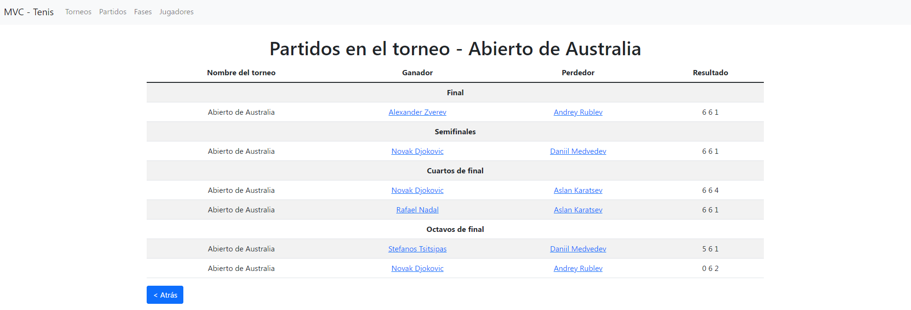

# Basic PHP MVC for practice

## Table of contents 👇

- [✨ Explanation](#-explanation)
- [⚓ Try the mvc](#-try-the-mvc)
- [🚀 Usage](#-usage)
- [💛 Contact](#-contact)

### ✨ Explanation

This is a basic project to improve my PHP and **MVC** skills. It's part of an exercise that I did in my two year web development course, but I tried to rewrite the code using **clean code**.

The aim of the project is to show a tennis database (a simple one) that stores matches, players, tournaments and phases. I know the database could be improved to separate the results (for example) of each match into a single table that stores sets and the match id, but I prefer to keep it simple because this is a personal project to understand the MVC concepts.

### ⚓ Try the mvc

1. Import the `db.sql` script into your PHPMyAdmin.
2. Go to your localhost and then to the `Torneos_controller.php` file to start the application.
3. If you want to change the database be careful and change the `config_db.php` accordingly.

### 🚀 Usage

The entry point of the application is the **Torneos_controller.php** file that manages all the routes and functions that the application needs to invoke to obtain the different pages. A better practise could be to separate the logic of the main application logic (routes) into a single file called **index.php** which loads the controller.

Anothe improvement for the project could be to put some of the views together (for example, the update/create view of the players), but I think it's a good starting point to separate the views due to understanding the application logic.

I have created a basic _CRUD_ for players and matches, so you can add a new match whitin a tournament. You can also create, edit and delete players.

### 💛 Contact

If you have some doubts or need to ask something about the project, feel free to reach me here:

- Twitter: [https://twitter.com/jgcarrillo](https://twitter.com/jgcarrillo_)
- LinkedIn: [https://es.linkedin.com/in/jgcarrilloweb](https://es.linkedin.com/in/jgcarrilloweb)
- Website: [https://jgcarrillo.com/](https://jgcarrillo.com/)
